# Auschwitz I Educational 3D Reconstruction

Interactive OpenGL 3.3 educational reconstruction of Auschwitz I, implemented in modern C++17 with a modular zone architecture, multi-pass rendering, dynamic lighting, and procedural geometry systems.

## Project Overview

- Rendering API: OpenGL 3.3 Core
- Language standard: C++17
- Window/input: GLFW
- GL loader: GLAD
- Math: GLM
- Image loading: STB Image

The simulation is driven by a central scene orchestrator that initializes all primitives, subsystems, zones, and lights, then renders the world in seven ordered passes each frame.

## Why This Project Stands Out

- 7-pass renderer: skybox, stars, opaque, celestial, alpha, particles, HUD.
- Dynamic lighting system: 2 directional + up to 32 point + up to 36 spot lights.
- Global runtime toggles: ambient, diffuse, specular, emissive, and all textures (0-4 keys).
- Time-of-day system with sun/moon movement, night stars, and lamp transitions.
- 4-point viewport mode: X view, Y view, Z view, and isometric (toggle with V).
- Flyweight-based mesh reuse for procedural/curved assets (shared VAO/VBO/EBO drawn across instances).
- Camera-proximity light culling path to keep active uploaded lights bounded.
- Train module: external rail line, locomotive + 5 bogeys, gate stop-and-go cycle, front spotlight.
- Soldier courtyard module: grid formation, articulated primitive soldiers, parade animation toggle.
- Procedural geometry: L-system trees, Bezier-based meshes, and ruled surfaces.
- Zone-based world layout: gate, fences, towers, barracks, interiors, block 11, crematory, admin.
- Texture fallback path for missing assets to keep the scene renderable.

## Current Architecture

### Core Engine Files

- src/main.cpp
    - Application entry point
    - GLFW/GLAD setup
    - Input callbacks and control mapping
    - Main render loop
- src/Scene.h
    - Central orchestrator for initialization, update, and rendering
    - Light setup/upload (directional, point, spot)
    - Zone rendering dispatch and runtime texture management
- src/Camera.h
    - Free-fly camera movement and mouse look
- src/Shader.h
    - Shader compile/link/uniform helper
- src/Texture.h
    - Texture load helper with fallback paths
- src/DayNightCycle.h
    - Time-of-day progression and day/night lighting factors
- src/HUD.h
    - HUD rendering
- src/HorizonSystem.h
    - Horizon layer and fog rendering
- src/LSystemTree.h
    - Procedural trees (branches/leaves)
- src/ParticleSystem.h
    - Snow and smoke particles

### Primitive Mesh Modules

- src/primitives/Cube.h
- src/primitives/Cylinder.h
- src/primitives/Sphere.h
- src/primitives/Plane.h
- src/primitives/Pyramid.h
- src/primitives/BezierTube.h
- src/primitives/RuledSurface.h

### Zone Modules

- src/zones/GroundZone.h
- src/zones/BarrackGrid.h
- src/zones/BarrackInteriors.h
- src/zones/EntranceGate.h
- src/zones/FenceSystem.h
- src/zones/GuardTowers.h
- src/zones/StreetLamps.h
- src/zones/Block11Zone.h
- src/zones/CrematoryZone.h
- src/zones/AdminZone.h
- src/zones/TrainSystem.h
    - Rail track outside entrance fence
    - Animated locomotive plus five bogeys
    - Gate stop and depart behavior
    - Train headlight spotlight integration
- src/zones/SoldiersCourtyard.h
    - Central parade courtyard
    - Grid formation of primitive human figures
    - Animated marching-in-place toggle

## Rendering Pipeline (7 Passes)

Executed in this order every frame:

1. Clear + Skybox
2. Stars (unlit)
3. Opaque geometry (Phong)
4. Celestial bodies and emissive bulbs (unlit)
5. Alpha/transparency
6. Particles
7. HUD overlay

## Lighting Model

Defined in shaders/phong.frag and populated from src/Scene.h.

- Directional lights: 2 (sun and moon)
- Point lights: up to 32
- Spot lights: up to 36
    - Includes guard towers, street lamps, and train headlight slot

## World Layout Notes

- Barrack grid currently renders 24 barracks (4 rows x 6 columns).
- Entrance gate is on the eastern side of camp bounds.
- Train line runs parallel to the entrance-side fence, outside the perimeter.
- Central courtyard (Appellplatz/parade area) is centered in camp core and used by soldier formation.

## Runtime Behavior

- MSAA 4x is enabled through GLFW window hints.
- Shaders and textures are loaded via relative paths from working directory:
    - shaders/
    - textures/

## Controls

### Movement and Camera

- W / A / S / D: move
- Left Shift: sprint
- Space / Left Ctrl: move up / down
- Mouse: look
- Scroll: FOV zoom

### System and UI

- T: cycle time speed (pause / 1x / 8x / 30x)
- H: toggle HUD
- C: toggle cursor lock
- F: toggle fullscreen
- J: trigger train run
- U: increase train speed
- I: decrease train speed
- P: toggle soldier parade animation
- G: toggle doors
- K: toggle windows
- V: toggle normal / 4-point view
- 1: toggle ambient lighting
- 2: toggle diffuse lighting
- 3: toggle specular lighting
- 4: toggle emissive lighting
- 0: toggle all textures globally
- ESC: quit

### Interactive Scene Controls

- G: toggle doors
- K: toggle windows
- J: trigger train run
- U / I: increase / decrease train speed
- P: toggle soldier parade animation

## Build and Run

### Prerequisites

- Windows
- Visual Studio 2022 or newer with C++17 toolchain
- OpenGL 3.3 capable GPU
- extern/ directory available locally with:
    - extern/lib/glfw3.lib
    - GLAD headers/sources
    - GLM headers
    - STB image headers

### Build Command (MSBuild)

```powershell
msbuild Auschwitz_tour.vcxproj /p:Configuration=Debug /p:Platform=x64
```

### Output

- x64/Debug/Auschwitz_tour.exe

## Workspace Structure (High-Level)

```text
/
|- Auschwitz_tour.vcxproj
|- Auschwitz_tour.slnx
|- shaders/
|- textures/
|- src/
|  |- main.cpp
|  |- Scene.h
|  |- Camera.h
|  |- Shader.h
|  |- Texture.h
|  |- DayNightCycle.h
|  |- HUD.h
|  |- HorizonSystem.h
|  |- LSystemTree.h
|  |- ParticleSystem.h
|  |- primitives/
|  `- zones/
`- extern/
```

## Screenshots

### Camp Views

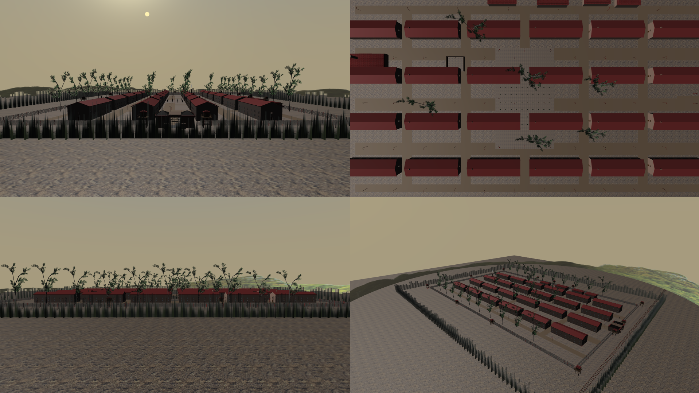
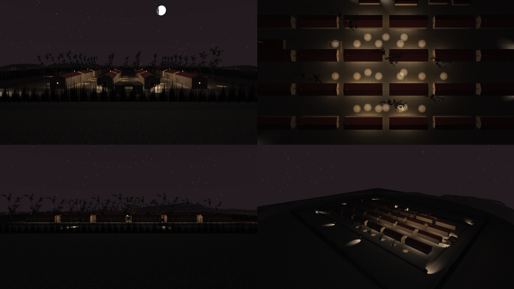
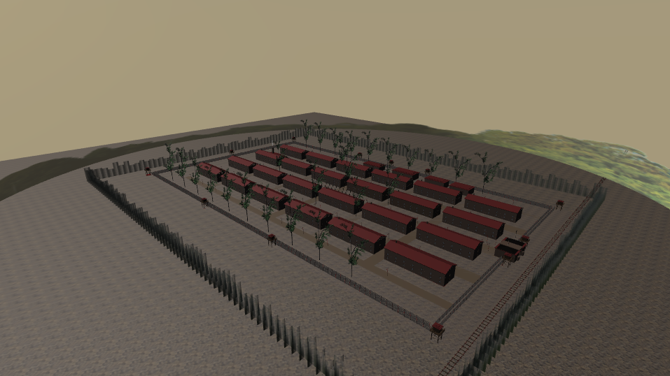

### 4-Point View Mode

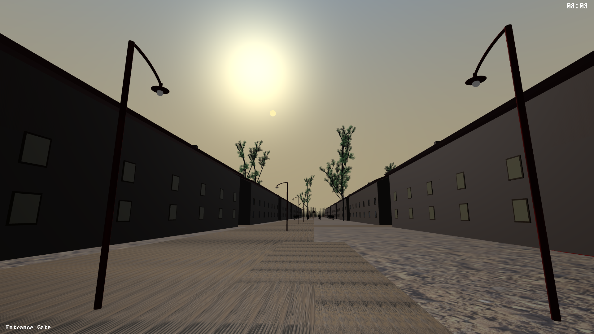
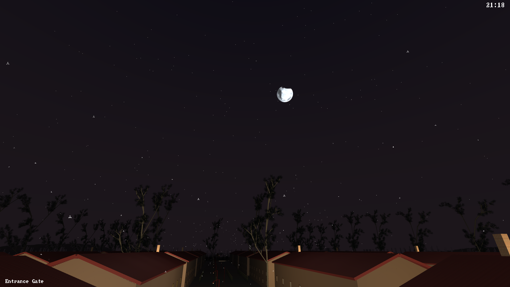

### Entrance and Courtyard

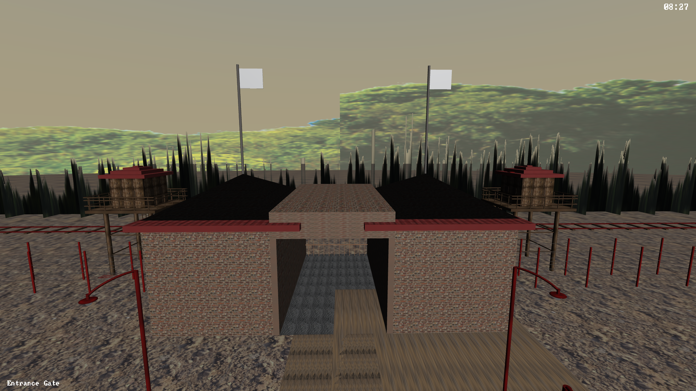
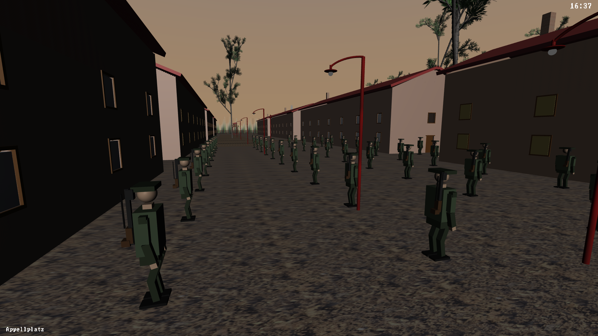
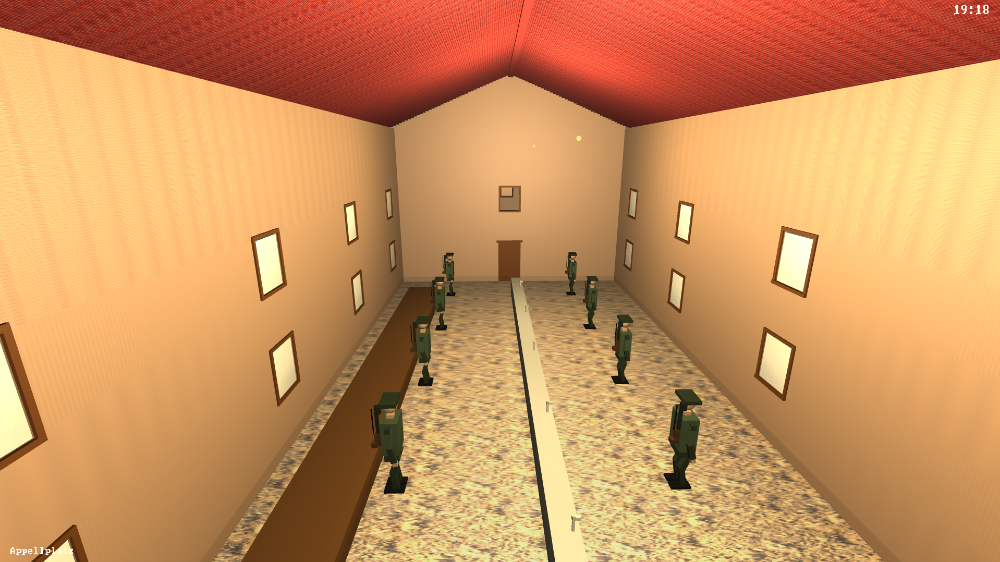

### Train System

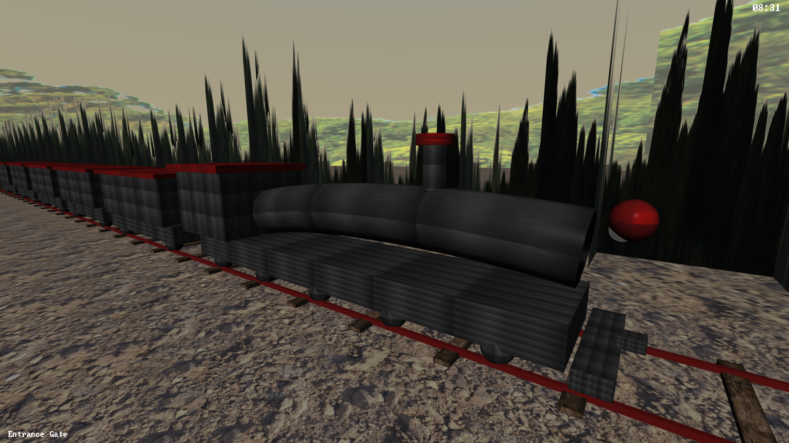

### Interiors

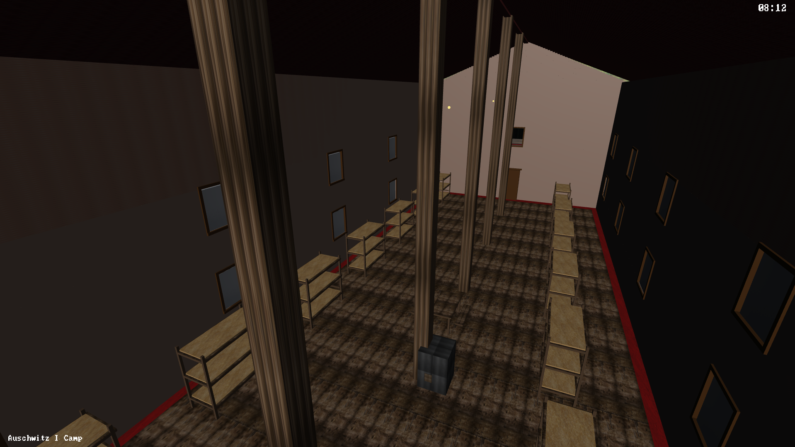
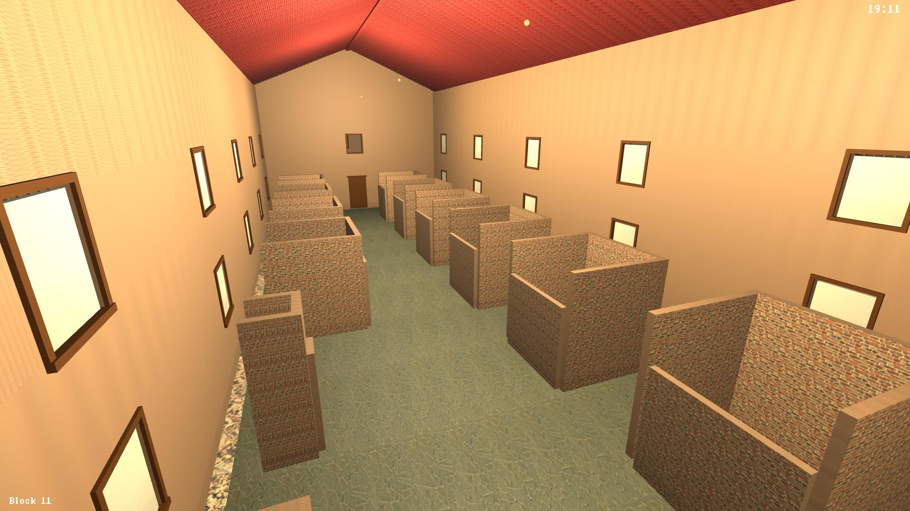

### Procedural Features

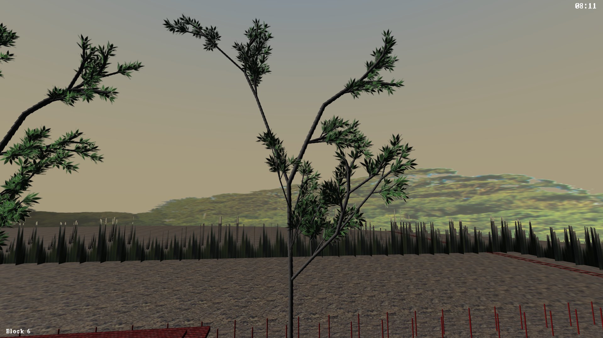
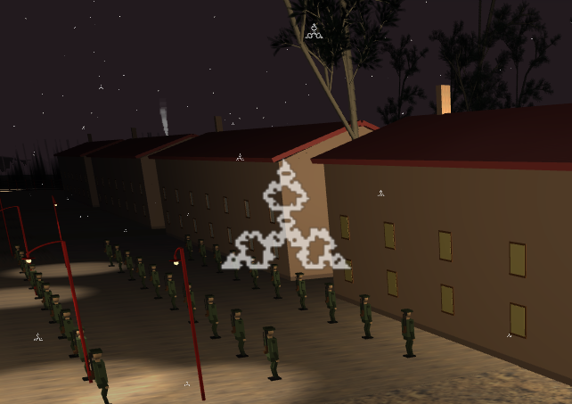

## Notes for Contributors

- Add new world sections as isolated zone headers under src/zones/.
- Wire new zones through src/Scene.h init/update/render flow.
- Add new zone headers to Auschwitz_tour.vcxproj and Auschwitz_tour.vcxproj.filters.
- Avoid using legacy code under old/ for new implementations.
